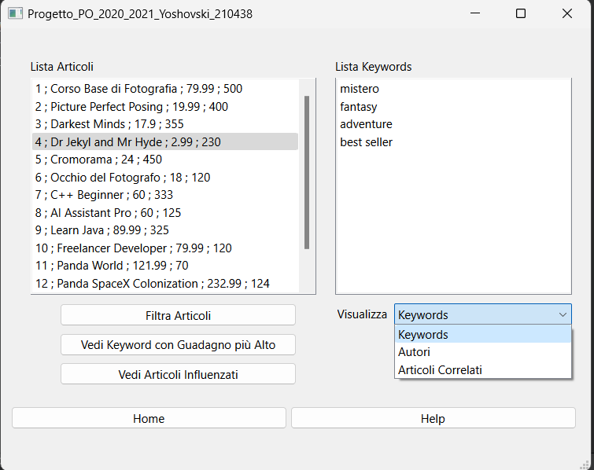
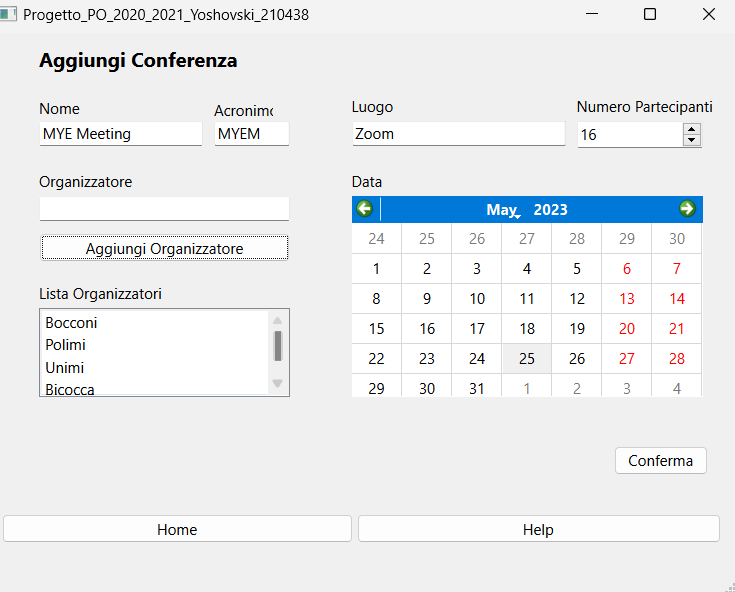

Created by Stefan Yoshovski on February 2021 during studies at University of Calabria  (Italy)  
LinkedIn: https://www.linkedin.com/in/stefan-yoshovski/

# University-OOP-Project
Object-Oriented Programming project: C++ implementation with Qt framework for managing articles and authors.  
Achieved perfect score. #OOP #C++ #Qt

## Table of Contents

- [Brief Introduction](#brief-introduction)
- [Project Sections](#project-sections)
- [Technologies and Programming Constructs Used](#technologies-and-programming-constructs-used)
- [How to Run the Program?](#how-to-run-the-program)
- [Snapshots](#snapshots)

## Brief introduction
The project aimed to showcase proficiency in object-oriented programming principles and practical application by utilizing C++ and the Qt framework. It was completed as part of the second-year Computer Science program at the University of Calabria (Unical). It involved building a graphical user interface to manage information related to articles and authors. The project was evaluated by the Professor with a score of 30/30 based on the following criteria:

- Quality, cleanliness, and flexibility of the code.
- Appropriate use of the data structures covered in the course.
- Proper utilization of fundamental object-oriented programming constructs such as encapsulation, composition, inheritance, and polymorphism.

## Project Sections

The project successfully implemented all the required sections, which are the following (for detailed explanations of the [project rquirements](/project_requirements.pdf), see attached [pdf file](/project_requirements.pdf)):

### Section A
- Addition of authors, conferences, journals, and articles.
- Proper display of all authors, conferences, journals, and articles.

### Section B
- Displaying articles by author, conference, and journal.

### Section C
- Calculation and display of various statistics such as lowest and highest priced articles by an author, average price of an author's articles, and annual revenue of conferences and journals.

### Section D
- Sorting and displaying articles by author, conference, journal, and keyword.

### Section E
- Displaying conferences with recurring keywords, journals without author publications, top 5 most used keywords, conferences without common keywords in articles, and most productive institutions.

### Section F
- Additional functionality such as displaying articles influenced by another article, sorting articles by the number of influenced articles, identifying influential conferences, reading data from text files, finding similar conferences, and identifying elite conference triplets.

The project demonstrates a solid understanding and application of object-oriented programming concepts, effective use of data structures, and appropriate utilization of key programming constructs. The code was implemented with high quality, ensuring clean and flexible solutions.

## Technologies and Programming Constructs Used

The project was developed using the following technologies, programming constructs, and features:

- C++: Object-oriented programming language used as the primary programming language.
- Qt framework: Cross-platform application development framework for building the graphical user interface (GUI).

Key programming constructs and features utilized in the project include:

- Encapsulation: Ensuring data privacy and encapsulating behavior within classes.
- Composition: Creating complex objects by combining simpler objects.
- Inheritance: Establishing a hierarchical relationship between classes to enable code reuse.
- Polymorphism: Leveraging polymorphic behavior to process objects of different types through a common interface.
- Data Structures: Proper utilization of data structures covered in the course for efficient data management.

Please note that this is not an exhaustive list, and there might be additional programming constructs and features employed based on the specific requirements and design of your project.

## How to run the program?

To run the program:

1. Clone the repository.
2. Install Qt and any necessary dependencies.
3. Build and compile the project.
4. Run the executable file.
5. Import the `elementi.txt` file to populate initial data.
6. Interact with the program using the graphical user interface.

## Snapshots

For all demo snapshots, please refer to the [images](/images) folder.  
For the [project rquirements](/project_requirements.pdf), plese refer to the [pdf here](/project_requirements.pdf).

Here are a couple of snapshots showcasing the user interface and functionality of the application:

.
